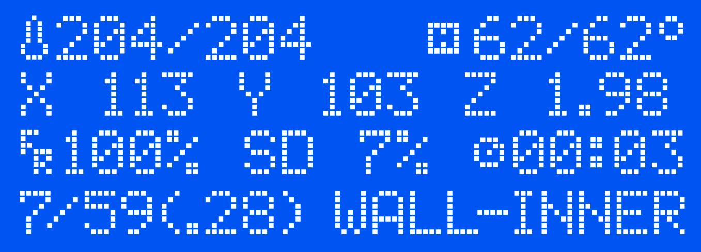

# Show Layer Details GCODE Script

## **WARNING: This is a work in progress! **

A simple offline script to process your ideaMaker Slicer generated GCODE and add more details: current and total layers, layer height and type of structure

## How to use
- Open the webpage
- Click Upload
- Save the processed GCODE file

## Motivation and history

## Other slicers 
### Cura

### Prusa Slicer

### Simplify3D

## Acknowledgments

* Inspired on [ShowLayer script](https://github.com/AmedeeBulle/ShowLayer/blob/master/scripts/ShowLayer.py) by Philippe Vanhaesendonck

## License

- **[MIT license](http://opensource.org/licenses/mit-license.php)**
- Copyright 2020 © <a href="http://samuelcarreira.com" target="_blank">Samuel Carreira</a>.
